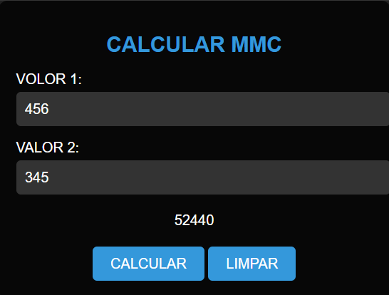

# CALCULAR MMC
🆎CALCULADORA DE MMC EM HTML, CSS E JS.

  

## DESCRIÇÃO:
O "Calculador MMC" é uma aplicação que permite calcular o Mínimo Múltiplo Comum (MMC) de dois números fornecidos pelo usuário. Abaixo estão os principais recursos implementados:

1. Calcular MMC:
   - Ao clicar no botão "CALCULAR", o sistema calcula o MMC dos dois números fornecidos utilizando o algoritmo recursivo.

2. Limpar Campos:
   - Ao clicar no botão "LIMPAR", todos os campos de entrada são resetados, incluindo os valores dos números e o resultado do cálculo do MMC.

## EXECUTANDO O PROJETO:
1. Informar os Números:
   - Insira o primeiro número no campo "VALOR 1".
   - Insira o segundo número no campo "VALOR 2".

2. Calcular MMC:
   - Após inserir os números, clique no botão "CALCULAR" para calcular o MMC.

3. Visualizar Resultado:
   - O sistema exibirá o resultado do cálculo do MMC na área designada abaixo dos campos de entrada.

4. Limpar Campos:
   - Se desejar limpar os campos e o resultado do cálculo, clique no botão "LIMPAR". Isso restaurará os campos para seus valores padrão e limpará o resultado do cálculo do MMC.

## NÃO SABE?
- Entendemos que para manipular arquivos em `HTML`, `CSS` e outras linguagens relacionadas, é necessário possuir conhecimento nessas áreas. Para auxiliar nesse aprendizado, oferecemos cursos gratuitos disponíveis:
* [CURSO DE HTML E CSS](https://github.com/VILHALVA/CURSO-DE-HTML-E-CSS)
* [CURSO DE JAVASCRIPT](https://github.com/VILHALVA/CURSO-DE-JAVASCRIPT)
* [CONFIRA MAIS CURSOS](https://github.com/VILHALVA?tab=repositories&q=+topic:CURSO)

## CREDITOS:
- [PROJETO CRIADO PELO VILHALVA](https://github.com/VILHALVA)

